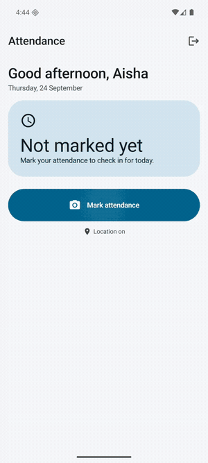
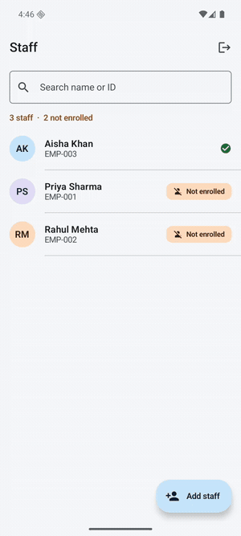
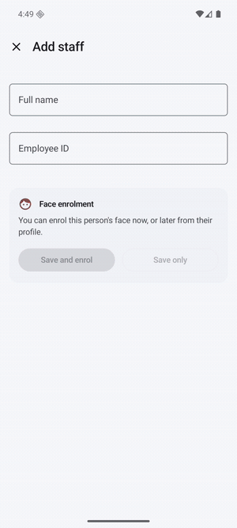

# Attendance

An Android attendance app with two roles. An **admin** manages staff and enrols
their faces; a **staff** member marks attendance with a selfie that has to match
the enrolled face, and the app records the timestamp, the selfie and the
location.

Everything runs on-device. There is no backend, no network call for recognition,
and no face data leaves the phone.

There are **two front ends over the same design**: the Android app in `app/`,
and a React Native (Expo) web build in `mobile/` that installs on an iPhone as a
PWA. Both run the same MobileFaceNet file through the same alignment maths at
the same threshold. See [Also runs on an iPhone](#also-runs-on-an-iphone).

**Live:** [yash-salarybox.vercel.app](https://yash-salarybox.vercel.app). Open it
in Safari on an iPhone and use Add to Home Screen.

---

## Demo

### Marking attendance with a face match

The quality gates pass, auto-capture counts down, the selfie is matched against
the enrolled templates, and the record is written. This is the real pipeline:
ML Kit detection, eye alignment, MobileFaceNet, cosine match. **This attempt
scored 0.9933 against a 0.55 threshold.**



### The admin side

Staff list showing who still needs enrolling, then a profile with the three
enrolment crops, the attendance history, and the match confidence for each
record.



### Adding a staff member

Validation is late-then-early: nothing is judged until a field loses focus, and
once an error has shown it clears on the keystroke that fixes it. A duplicate
employee ID names whoever already holds it.



> **About the face in these recordings.** No real device was available, so these
> are Android 16 emulator captures with a **photograph** fed to the emulator's
> virtual front camera (`-camera-front imagefile:`). It is the standard
> `ageitgey/face_recognition` test fixture, not a live person and not a webcam.
> The detection, alignment, embedding and matching are genuinely running; only
> the light hitting the lens is synthetic.

---

## Demo credentials

| Role  | Username  | Password   |
|-------|-----------|------------|
| Admin | `admin`   | `admin123` |
| Staff | `EMP-001` | `staff123` |

Also seeded: `EMP-002` (Rahul Mehta) and `EMP-003` (Aisha Khan), same password.
These are shown on the sign-in screen too, so the APK is usable without coming
back to this file.

**A new staff member signs in with their employee ID and `staff123`.** Adding
someone through the admin screen creates their login automatically.

### Trying it end to end

1. Sign in as `admin`.
2. Open a staff member and tap **Enrol face now**. Take the three photos.
3. Sign out, sign in as that staff member's employee ID.
4. Tap **Mark attendance**. Your face is matched against the enrolment.
5. To see rejection working, enrol one person's face and try to mark attendance
   as a different person.

---

## Also runs on an iPhone

`mobile/` is a second front end for the same product: **Expo + React Native +
gluestack-ui**, exported as a static PWA. It exists for two reasons that turned
out to be the same reason.

gluestack-ui is a React Native component library. There is no way to render it
inside Jetpack Compose, so "use gluestack" necessarily means a React Native app.
And a React Native app exported to the web is the one route onto an iPhone that
needs no Mac, no Apple Developer account and no App Store review: open the URL
in Safari, Add to Home Screen, and it runs full screen with the real front
camera.

### It is the same pipeline, not a lookalike

The web build is a port, not an approximation:

- **The same model file.** `mobile/scripts/sync-assets.mjs` copies
  `mobile_face_net.tflite` out of the Android module at build time rather than
  keeping a second copy, and prints its sha256 so the claim is checkable. It
  runs in the browser through `@tensorflow/tfjs-tflite`.
- **The same alignment.** The ArcFace two-point similarity transform from
  `FaceAligner.kt`, ported constant for constant.
- **The same scaling and matcher.** `(pixel - 127.5) / 128`, cosine similarity,
  best-of-N across enrolled samples, threshold 0.55.

Detection is the one deliberate difference: ML Kit is Android-only, so the web
build uses MediaPipe Tasks Vision, which is strictly richer (478 landmarks
including iris centres, a head-pose matrix and blendshapes for eye openness).

Because the pipeline is the same, the threshold could be carried over instead of
guessed. `/diagnostics` re-runs the Android instrumentation accuracy matrix in
the browser, over the same seven photographs:

| | Android (ML Kit) | Web (MediaPipe) |
|---|---|---|
| genuine, 6 pairs | min 0.832, mean 0.914 | min **0.805**, mean **0.903** |
| impostor, 15 pairs | max 0.121 | max **0.146** |
| margin | 0.711 | **0.659** |
| threshold 0.55 | inside the gap | inside the gap |

The small differences are the different landmark source and a different
resampler, not a different idea. Open `/diagnostics` on the deployed build to
reproduce the table, and to look at the aligned crops, which is how the
alignment bug below was caught in the first place.

### Running it

```bash
cd mobile && npm install && npm run web
```

Then open the printed URL. `npm run build:web` produces a static `dist/`.

### Putting it on your phone

It is deployed at **[yash-salarybox.vercel.app](https://yash-salarybox.vercel.app)**,
built by Vercel from `main` on every push with `mobile/` as the root directory.
On the phone: open it in Safari, share sheet, Add to Home Screen. It installs
with its own icon, runs without Safari's chrome, and asks for the camera the
first time you mark attendance. Sign in as `admin` / `admin123` to enrol a face
first; staff cannot mark attendance until they are enrolled.

To deploy your own copy, import the repository at vercel.com/new with **Root
Directory** set to `mobile`, or run `npx vercel --prod` from `mobile/`.
`mobile/vercel.json` sets the build command, the output directory, the
single-page fallback to `index.html`, and the `application/wasm` content type.

Any HTTPS host works. `getUserMedia` and WebCrypto both require a secure
context, so plain `http://` over a LAN will not do.

### The bug that only existed on Linux

The first deployment built cleanly and then showed a blank page. The identical
commit worked on the Windows machine it was written on. Three plausible fixes
(an SPA export instead of pre-rendering, a NativeWind upgrade, a single bundle
instead of code-split chunks) each addressed a real risk and none of them was
the cause.

What found it was a local Linux build, cloned into WSL's own filesystem rather
than the Windows mount, whose output **hash matched the file Vercel was
serving**. That turned a three-minute deploy per guess into a two-minute local
loop, and made it possible to diff the two bundles module by module.

The cause: react-native-css's Babel plugin, loaded through the `nativewind/babel`
preset, rewrites imports inside react-native-web's **own** files to its
className-aware wrappers. It decides whether a file belongs to react-native-web
with `source.split("react-native-web/dist")`, which only matches forward-slash
paths. On Windows the paths contain backslashes, the check never matches, and
react-native-web is left alone. That is the only reason the local build worked.
On Linux it matches, 27 of react-native-web's internal imports are rewired to
wrappers that require react-native-web's export barrel back while it is still
initialising, and the bundle contains 22 require cycles. The first to fire reads
`FlatList` before it has been assigned.

The fix is four lines in `mobile/babel.config.js`: the preset applies to
everything except react-native-web. On Windows it is a provable no-op (the
exported bundle hash does not change). On Linux the output now matches the
Windows bundle module for module, so what is deployed is the code that was
verified end to end.

### What is different from the Android build

- Storage is IndexedDB in that browser, so data does not follow you to another
  device and clearing site data resets it. The Android build uses Room.
- The first visit downloads roughly 20 MB of model and wasm. It is cached after
  that, and the staff home screen starts the download in the background while
  you read it rather than when you tap Mark attendance.
- Reverse geocoding is not wired up, so records show coordinates rather than a
  street address.
- It cannot run in Expo Go. The face pipeline needs wasm that Expo Go has no way
  to load, which is exactly why the web export is the delivery route.

---

## Stack

| Concern           | Choice                                            |
|-------------------|---------------------------------------------------|
| Language / UI     | Kotlin, Jetpack Compose, Material 3               |
| Architecture      | MVVM, unidirectional data flow, single Activity   |
| Navigation        | Navigation Compose, type-safe `@Serializable` routes |
| Database          | Room (KSP)                                        |
| Session           | DataStore Preferences                             |
| Camera            | CameraX with the Compose `CameraXViewfinder`      |
| Face detection    | ML Kit Face Detection (bundled)                   |
| Face recognition  | MobileFaceNet on LiteRT / TFLite                  |
| Location          | Play Services `FusedLocationProviderClient`       |
| Images            | Coil 3                                            |
| DI                | Manual constructor injection                      |

Versions are pinned in [`gradle/libs.versions.toml`](gradle/libs.versions.toml).
AGP 9.4.1, Gradle 9.7.0, Kotlin 2.4.20, compileSdk 37, targetSdk 36, minSdk 26.

The web build in `mobile/` is a different stack for the same design:

| Concern           | Choice                                            |
|-------------------|---------------------------------------------------|
| Language / UI     | TypeScript, React Native, gluestack-ui on NativeWind |
| Framework         | Expo SDK 57, static web export                    |
| Navigation        | expo-router, file-based                           |
| Database          | IndexedDB                                         |
| Camera            | `getUserMedia` into a `<video>`, frames read per rAF tick |
| Face detection    | MediaPipe Tasks Vision FaceLandmarker             |
| Face recognition  | The same MobileFaceNet file, via `@tensorflow/tfjs-tflite` |
| Location          | `navigator.geolocation`                           |

---

## How face recognition actually works

This is the part the brief cares about, so here is the whole pipeline.

**Detection and recognition are different problems.** ML Kit answers *where is a
face and how is it posed*. It does not answer *whose face is it* and has no API
that does. Identity needs an embedding model, so the two are separate components
behind separate interfaces.

### The pipeline

1. **Live analysis.** CameraX `ImageAnalysis` runs at 640x480 with
   `KEEP_ONLY_LATEST`, feeding ML Kit. Each frame yields a bounding box, head
   Euler angles, eye landmarks and eye-open probabilities.

2. **Quality gates.** Each frame is reduced to exactly one state, chosen by
   priority: no face, multiple faces, too dark or bright, too close, too far,
   off-centre, head turned, eyes closed, unstable, ready. One instruction at a
   time is the design, not a shortcut: three simultaneous complaints are
   unactionable, one is a task.

3. **Auto-capture.** After three consecutive good frames, a three second
   countdown runs. Anything slipping cancels it and it always restarts from
   three. A manual shutter appears after eight seconds of struggle, and
   immediately when a screen reader is active.

4. **Alignment.** The eye landmarks are mapped onto the ArcFace canonical
   112x112 template with a similarity transform (rotation, uniform scale,
   translation). Embeddings are not rotation invariant, so a head tilted fifteen
   degrees produces a measurably different vector for the same person. This step
   is the cheapest accuracy win in the pipeline, and the easiest to get silently
   wrong: see below.

5. **Embedding.** The aligned crop is normalised to `(px - 127.5) / 128.0`, RGB,
   NHWC, and run through MobileFaceNet to get a 192-d vector.

6. **Matching.** Cosine similarity against the stored templates, accepting at
   **0.55** or above. Where that number comes from is below, and it is measured.

### The model

`app/src/main/assets/mobile_face_net.tflite`, 5,243,108 bytes,
SHA-256 `b67366e085ec9f6c2afb05c10397a46edeb823367abaec77f64f5ce946ac2847`.

It is committed rather than downloaded so the app works offline on first run and
so the build is reproducible. Its properties were verified by loading and
running it rather than assumed:

- input `[1, 112, 112, 3]` float32
- output `[1, 192]` float32
- **the graph already ends in an L2 normalisation**, so embeddings arrive with
  norm 1.0

That last point matters. Several widely mirrored MobileFaceNet exports disagree
with each other: some are compiled with a fixed batch of 2, some emit
un-normalised vectors with norms around 32. Against one of those, a cosine
threshold would pass everything. So the code reads the tensor shapes from the
model at load time instead of hardcoding them, and normalises defensively even
though this file does not need it.

MobileFaceNet reports 99.4%+ on LFW. That is the architecture on a benchmark,
not this app on a phone in an office corridor.

### Why three enrolment samples

One frontal sample is brittle against the thing that always varies at check-in,
which is head angle. Three samples at frontal, slight left and slight right
cover the realistic range for someone holding a phone.

They are stored **separately and matched on the best score**, not averaged. The
mean of several poses lands in a region that represents none of them; "closest to
any pose I have seen you in" is both more accurate and easier to reason about.

### The alignment bug that measuring caught

`ML Kit`'s `FaceLandmark.LEFT_EYE` is named from the **image** point of view, not
the subject's. The first version of `FaceAligner` assumed the opposite and swapped
the two eyes.

That does not throw, does not log, and does not look wrong in code. It rotates
every aligned crop by roughly 180 degrees. And because **both** enrolment and
verification run through the same function, the embedding space stayed
self-consistent: matching still "worked", on upside-down faces the model was
never trained on.

What it cost, measured on the same fixtures before and after the one-line fix:

| | swapped eyes | correct |
|---|---|---|
| Genuine min | 0.854 | 0.832 |
| **Impostor max** | **0.767** | **0.121** |
| Impostor mean | 0.648 | −0.020 |
| **Separation margin** | **0.087** | **0.711** |

An eight-fold collapse in impostor similarity. With correct alignment different
people land near orthogonal, which is what these embeddings are supposed to do.

It was found by looking at the enrolment thumbnails on the staff profile and
noticing they were upside down. `alignedCropPutsEyesOnTheTemplate` now catches it
properly: it re-runs detection on the aligned crop and asserts the eyes land
within 8px of the template points. Before the fix, ML Kit could not find a face
in the aligned output at all.

### The threshold, and why measuring it mattered

`FaceRecognitionAccuracyTest` runs this exact pipeline on-device over 8
photographs of 4 people and reports every pairwise score:

| | pairs | min | mean | max |
|---|---|---|---|---|
| **Genuine** (same person) | 6 | **0.832** | 0.914 | 0.998 |
| **Impostor** (different people) | 15 | -0.282 | -0.020 | **0.121** |

Different people land near orthogonal, which is what correctly aligned face
embeddings should do. The gap is **0.711** wide, so the choice is not delicate.
The constant is **0.55**: 0.28 of headroom for genuine faces degraded by real
light and pose, and 0.43 before any impostor here would be accepted.

**This constant has been wrong twice, and both stories are worth keeping.**

It started at **0.65**, carried over from published defaults for the
architecture. Measurement showed 0.65 sat *inside the impostor distribution of
the day*: it would have accepted **all fifteen impostor pairs**. The feature
would have demoed perfectly and been worthless as a control, because a demo only
ever exercises the true-accept case.

It was then set to **0.80**, correctly, for a pipeline that was quietly feeding
the model upside-down crops. Fixing the alignment collapsed impostor scores from
a 0.65 mean to roughly zero and made 0.80 needlessly strict, leaving only 0.03 of
genuine headroom.

The lesson in both is the same: a threshold is a property of the whole pipeline,
not a number you can look up. Change anything upstream and it has to be
re-measured, which is exactly why the measurement is a test and not a comment.

Caveats, because the sample is small:

- 4 identities, 21 pairs. Both tails widen with more data.
- Real check-in selfies vary more than curated photographs, so production genuine
  scores will run lower than 0.832.
- A false accept (marking attendance as a colleague) is worse than a false reject
  (a retry), so the bias is upward, and the UI gives three graceful retries.

Supporting decisions that survive any threshold change:

- it is one named constant, `FaceMatcher.DEFAULT_THRESHOLD`
- the value in force is **written onto every attendance record**, so changing it
  later cannot retroactively rewrite what past decisions meant
- the achieved score is stored and shown to the admin, so drift is visible
- the test asserts the constant still sits in the measured gap, so a future edit
  that reintroduces either mistake fails CI

One further measurement worth recording: two images of pure random noise score
**0.91** against each other. Noise is far outside the model's training
distribution and collapses to a similar region of the embedding space. So **the
quality gates are load-bearing for security, not just usability.** Without "is
this actually a face, in focus, facing the camera", the matcher is much weaker
than any threshold suggests.

---

## Decisions worth explaining

**A failed location fix does not block attendance.** Someone in a basement
stockroom with no GPS is still at work, and refusing to record it punishes them
for their building. The record is written with the *reason* the fix failed
(`PERMISSION_DENIED`, `SERVICES_DISABLED`, `TIMED_OUT`, `UNAVAILABLE`), which is
strictly more information than a silent null and lets an admin tell "denied the
permission" from "could not see the sky".

**Selfies are never mirrored.** CameraX mirrors the front-camera *preview*,
because a mirror is what people expect of themselves, but deliberately leaves the
*capture* un-mirrored. Only rotation is applied, on both the enrolment and the
verification path. Mirroring one but not the other would put the two in different
embedding spaces and quietly break every match.

**The match score is shown to the admin and never to the staff member.** An admin
can act on a consistently marginal score. A staff member seeing "87% match" learns
nothing actionable and worries about the other 13.

**Three attempts, then a clean stop.** Letting someone burn retries forever is
worse than saying so and naming the next step ("ask your admin to re-enrol").

**Photos live in internal storage, not MediaStore.** A selfie proving attendance
is a private employee record. MediaStore would put it in the device gallery next
to holiday photos, readable by any app with media permission.

**Manual DI instead of Hilt.** For a single module with about eight
collaborators, Hilt buys an annotation processor and a layer of indirection to
save writing one composition root. The trade flips the moment this gains modules
or scoped bindings. `AppContainer` is the whole of it.

**Passwords are PBKDF2-HMAC-SHA256 with a per-user salt**, at 120k iterations and
compared in constant time. The credentials here are dummy ones so this protects
nothing, but a plaintext password column is exactly the kind of thing that
survives into a real product.

**Sign-in does not say which half was wrong.** Distinguishing "no such user" from
"wrong password" turns the login screen into a tool for discovering which employee
IDs exist.

---

## Design

The palette is a teal-leaning blue at roughly hue 205, with a terracotta accent.
The hue is a constrained choice rather than a taste one: green, amber and red are
all spoken for by attendance status, so the brand colour cannot be any of them
without making every screen ambiguous, and purple is the Material 3 baseline that
signals an uncustomised template. That leaves the blue-cyan band, and a calm
institutional blue is the right register for a screen about to photograph
someone's face. Terracotta is reserved exclusively for biometric enrolment, so
"face not enrolled" never borrows the error red.

Attendance status colours live **outside** the Material colour roles, in their own
token set. If "present" were mapped onto, say, tertiary, every future palette
change would silently change what "present" looks like. Status is also always
carried by an icon and a label, never by colour alone.

Other details that are deliberate:

- **Tabular figures** on the live clock, employee IDs and match scores, so digits
  do not reflow as values change.
- **Skeleton rows** rather than a spinner for the staff list. The shape of the
  content is known before it arrives.
- **`supportingText` always occupies its line** in forms, so the layout never
  jumps when an error appears.
- **Validate late, revalidate early.** A field is not judged until it loses focus;
  once it has shown an error it revalidates on every keystroke so the error clears
  the instant it is fixed.
- **Duplicate employee IDs name the holder.** Saying an ID is taken without
  saying who took it is half an error message.
- **Disabled controls state their reason** within a line of themselves.
- **Springs for spatial changes, tweens for colour**, because a spring on a colour
  overshoots into hues that are not in the palette. The countdown is linear: a
  timer that eases is a timer that lies.
- **Deterministic avatar tints** from a name hash, never `Random`.

### Capture-screen copy

The microcopy follows three rules: describe the device or the frame rather than
the person; phrase direction as moving the *phone*, because someone holding a
phone at arm's length moves the phone instinctively; and never use the words
"failed", "error" or "invalid" on a screen pointed at someone's face.

---

## Accessibility

- The scrim, oval and countdown ring are `clearAndSetSemantics`, so a screen
  reader is not read three unlabelled canvases.
- Guidance is one polite live region; the terminal result is assertive.
- Content descriptions carry state ("Hide password", not "Password visibility").
- **Auto-capture is disabled and the shutter is always visible when touch
  exploration is on.**

**Honest limitation:** someone who cannot see the preview cannot verify their own
framing, and no amount of spoken guidance fully closes that gap. What this app
does is phrase directions as phone movement, throttle announcements, and always
offer a manual shutter. It does not claim parity.

---

## Building

Needs JDK 17 and the Android SDK. No Android Studio required.

```bash
git clone https://github.com/yasharyas/yash_salarybox.git
cd yash_salarybox
./gradlew assembleDebug
```

The APK lands in `app/build/outputs/apk/debug/`. On Windows use `gradlew.bat`.

For a release build:

```bash
./gradlew assembleRelease
```

Release is R8-shrunk and split per ABI, with a universal APK also produced. It is
signed with a real key if a `keystore.properties` is present, and falls back to
the debug identity otherwise, so a fresh clone still produces something
installable.

Run the tests:

```bash
./gradlew testDebugUnitTest
```

---

## What was actually verified

Not just "it compiles". The app was installed on an Android 16 (API 36) emulator
and driven through sign-in, the admin staff list, a staff profile, the enrolment
intro, the live camera screen and the staff home, checking logcat for crashes at
each step, and later driven with a face in front of the virtual camera.
Seven real bugs came out of that and are fixed:

- **Sign-in rejected valid credentials on a fresh install.** Demo seeding ran
  from a Room `onCreate` callback, which fires part-way through the first
  database access, so the login query raced it and read an empty table. Seeding
  is now an awaited startup job.
- **The manual shutter never captured.** Its `LaunchedEffect` reset the same flag
  it was keyed on, so it cancelled its own capture coroutine. It is now keyed on
  a monotonic counter.
- **Every aligned face crop was upside down**, silently degrading matching. See
  the alignment section above.
- **Auto-capture kept firing behind the failure sheet.** After a failed match the
  analyzer went on emitting Ready frames, so attempts 2 and 3 fired themselves
  within seconds while the user was still reading why attempt 1 failed, taking
  them straight to the three-attempt lockout. The capture surface is now busy for
  as long as a result is on screen.
- **Any rotation threw you back to the root screen.** Session-driven navigation
  re-ran on every configuration change and popped the whole back stack, so
  rotating during enrolment discarded the photos taken so far. It now navigates
  only on a genuine role change.
- **Auto-capture cancelled its own photo.** Taking the picture inside the
  countdown's `LaunchedEffect` could not work: the first thing a capture does is
  move the state to `Capturing`, which made the effect's key false and cancelled
  the coroutine mid-capture. The symptom was a countdown that looped forever and
  a silent `LeftCompositionCancellationException`. Both capture paths now run off
  one monotonic counter that nothing about the state can invalidate.
- **The countdown ran twice for one capture.** Analyser frames arriving while the
  photo was being matched still published `Ready`, so a second countdown started
  behind the first. The controller now latches until the screen asks for a new
  attempt.

The last two were only findable because the failure path got a log line. It had
been `runCatching { ... }.onFailure { setState(CameraError) }`, which turned every
cause into the same unactionable "Camera unavailable".

The TFLite model was confirmed loading on-device from logcat
(`Replacing 263 out of 264 node(s) with delegate`, matching the 264 operators in
the bundled file), and the capture path correctly reports "No face in that photo"
against the emulator's synthetic camera scene.

### The web port is verified against these same numbers

`/diagnostics` in the web build re-runs the matrix below in the browser and
prints it on screen, so the two implementations can be compared directly rather
than taken on trust. See [Also runs on an iPhone](#also-runs-on-an-iphone).

### Face matching is verified, with real faces

The emulator's camera renders a synthetic scene with no face in it, so pointing
the app at it proves nothing about matching. Instead the pipeline is driven
directly by instrumentation tests over real photographs, which is both stronger
and reproducible. `EnrolAndMarkAttendanceTest` goes through the real
repositories:

- enrol a person from **three** photographs, then mark attendance with a
  **fourth photograph the system has never seen** → accepted at **0.9962**, with
  the selfie written to disk, the timestamp recorded, and the location status
  correctly stored as `PERMISSION_DENIED` rather than a silent null
- attempt the same as a **different person** → rejected at **0.7240**, and
  nothing is written: no orphan selfie, no partial row
- an unenrolled staff member → `NotEnrolled`, not a mismatch
- a second attempt the same day → `AlreadyMarkedToday`
- a photograph containing **two faces** → rejected rather than guessing the
  largest, which would let someone mark attendance standing next to a colleague

Run them yourself against a connected device or emulator:

```bash
./gradlew connectedDebugAndroidTest
```

**Still not verified:** the live camera path end to end with a real face in
front of a real lens, which needs hardware. Everything behind the shutter, which
is where the matching actually happens, is covered above.

---

## Limitations

These are real and I would rather name them than have them found.

1. **No liveness detection.** A photo of a photo will pass. Gating uses eye-open
   probability, head pose, face size and frame stability, which catch the
   accidental cases but not a deliberate one. Real anti-spoofing needs either a
   dedicated model or an active challenge, and is a project of its own.

2. **The threshold is calibrated on 4 identities, not a population.** 0.55 sits
   in a wide measured gap, but 21 pairs is a small sample and real check-in
   selfies vary more than curated photographs. See the threshold section above.

3. **One record per day, check-in only.** No check-out, no hours, no late
   classification. The status token set has `late` in it and nothing sets it yet.

4. **Location is recorded, not enforced.** There is no geofence, so the app
   records where someone was, not whether that is somewhere they should be.

5. **No tablet layout.** The admin side would benefit from a list-detail pane at
   600dp and up. It is single-pane everywhere.

6. **Local only.** Uninstalling the app destroys the data. Backup is off
   deliberately, since face templates are sensitive, and there is no export.

7. **Face templates are stored unencrypted** in the app's private database. That
   is the sandbox boundary and nothing more. A production build handling
   biometrics should add an encryption layer, and should have a retention and
   deletion policy behind it.

8. **The live camera path has no automated test.** 23 unit tests cover the
   matcher, embedding codec and validation; 8 instrumentation tests cover
   detection, alignment, embedding, matching and the full enrol-then-mark
   journey. What is not covered is CameraX itself: the viewfinder, the quality
   gates against a live stream, and auto-capture. Those were driven by hand on
   an emulator, as described above.

---

## Layout

```
app/src/main/java/com/yasharya/attendance/
├── AttendanceApp.kt          Application + AppContainer (composition root)
├── MainActivity.kt
├── camera/                   ImageProxy handling, ML Kit analyzer
├── data/
│   ├── local/                Room entities, DAOs, converters, seed, hashing
│   ├── repository/           Auth, Staff, Attendance
│   ├── PhotoStorage.kt
│   └── SessionStore.kt
├── face/                     Embedder, aligner, matcher, quality gates
├── location/
├── theme/                    Colour, type, shape, spacing, motion
├── ui/
│   ├── admin/                Staff list, add staff, profile
│   ├── attendance/           Mark attendance
│   ├── capture/              Shared camera surface and guidance copy
│   ├── components/
│   ├── enrolment/
│   ├── login/
│   ├── staff/                Home, history
│   ├── AppNavigation.kt
│   └── Routes.kt
└── util/
```

```
mobile/
├── app/                      expo-router routes, one file per screen
│   ├── +html.tsx             PWA shell, meta tags, MediaPipe bootstrap
│   ├── diagnostics.tsx       the accuracy matrix, re-run in the browser
│   └── pixels.tsx            every sprite, at the sizes the app uses them
├── components/ui/            gluestack-ui components
├── scripts/
│   ├── sync-assets.mjs       copies the model out of the Android module
│   └── make-icons.py         renders the PWA icons from the FACE sprite
└── src/
    ├── data/                 IndexedDB, PBKDF2, session, repository
    ├── face/                 aligner, embedder, landmarker, matcher, gates
    └── ui/                   screen shell, pixel art, camera surface
```

---

## Credits

MobileFaceNet architecture from *MobileFaceNets: Efficient CNNs for Accurate
Real-Time Face Verification on Mobile Devices* (Chen et al., 2018). The bundled
TFLite export is a widely mirrored community conversion. The ArcFace canonical
landmark template is from *ArcFace: Additive Angular Margin Loss for Deep Face
Recognition* (Deng et al., 2019).
